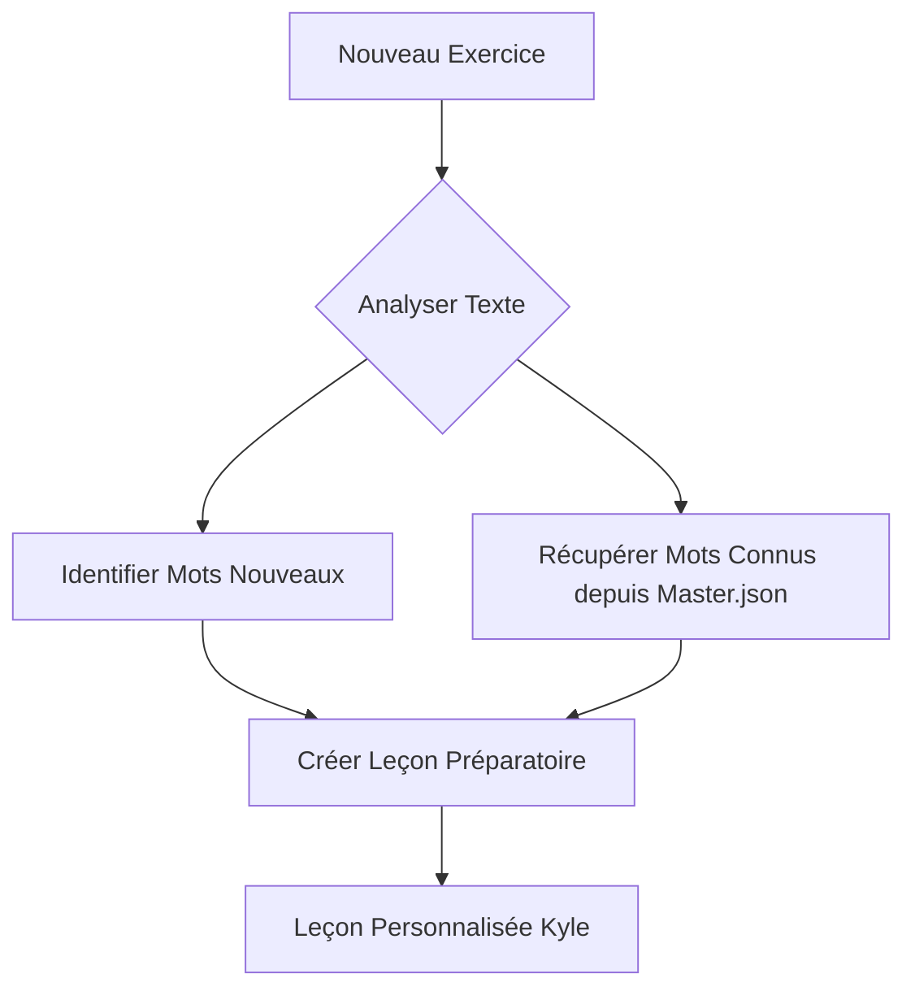
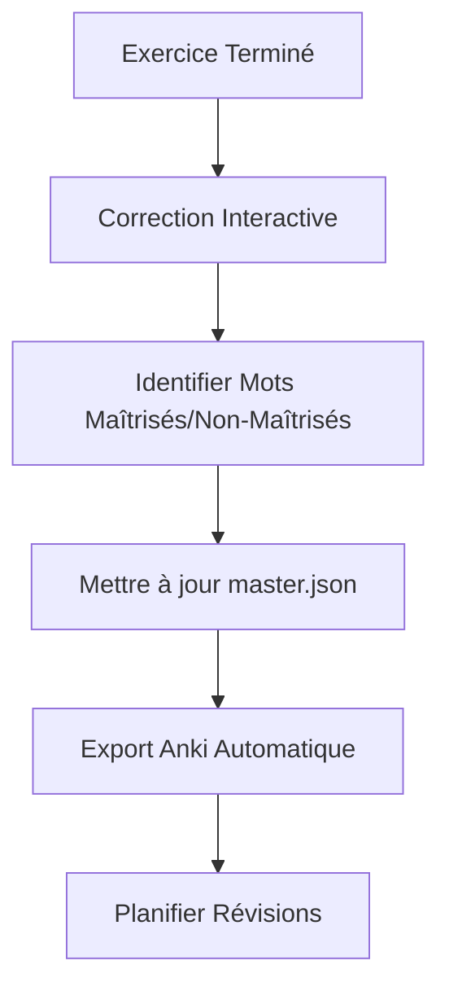

# 🔄 WORKFLOW UNIFIÉ - VOCABULAIRE ET LEÇONS

**Problème résolu** : Fragmentation des connaissances entre répertoires  
**Solution** : Centralisation intelligente avec workflow automatisé

---

## 🎯 **PRINCIPE CENTRAL : SOURCE UNIQUE DE VÉRITÉ**

### **📊 Hub Central : `/00_vocabulaire/`**
- **vocabulaire_master.json** = Base de données UNIQUE
- **Toutes les leçons** alimentent automatiquement le système central
- **Révisions centralisées** avec export Anki unifié
- **Progression trackée** globalement

---

## 🔄 **WORKFLOW UNIFIÉ PAR SESSION**

### **📚 AVANT L'EXERCICE : Génération Leçon Intelligente**



**Process automatisé** :
1. **Scanner le texte** → Identifier vocabulaire B2+
2. **Vérifier master.json** → Éviter redondance mots déjà acquis
3. **Générer leçon optimisée** → Focus sur VRAIMENT nouveau
4. **Contextualiser** → Exemples spécifiques au texte Kyle va lire

### **⏱️ PENDANT L'EXERCICE : Apprentissage Contextualisé**
- Kyle étudie **leçon personnalisée** (pas de mots déjà maîtrisés)
- **Efficacité maximale** : 15-20 minutes sur vraiment nouveau
- **Contexte préservé** : Vocabulaire préparé pour le texte exact

### **✅ APRÈS L'EXERCICE : Intégration Automatique**



**Process transparent** :
1. **Discussion post-exercice** → Identifier niveau de maîtrise réel
2. **Update master.json** → Nouveaux mots + niveaux de maîtrise
3. **Export Anki** → Révisions optimisées selon performance
4. **Planning révisions** → J+1, J+3, J+7, J+15

---

## 📁 **ARCHITECTURE UNIFIÉE**

### **🏗️ Structure Simplifiée**

```
/00_vocabulaire/ [HUB CENTRAL]
├── vocabulaire_master.json          # SOURCE UNIQUE
├── workflow_unifie.md              # Ce fichier
├── lecon_generator.py               # Script génération leçons
├── anki_export.py                   # Export/import automatique
├── progression_hebdomadaire.md      # Stats globales
└── revision_cyclique.md             # Planning révisions

/01_comprehension_ecrite/
├── exercice_XX_principal.md         # Exercice seul
├── exercice_XX_lecon.md             # Généré automatiquement
└── exercice_XX_correction.md        # Avec intégration vocab

/02_comprehension_orale/
├── exercice_XX_principal.md         # Exercice seul
├── exercice_XX_lecon.md             # Généré automatiquement
└── exercice_XX_correction.md        # Avec intégration vocab

[etc...]
```

### **🔄 Flux de Données Unifié**

```
NOUVEAU MOT → master.json → Anki → Révisions → Maîtrise → Réutilisation
     ↑                                                         ↓
Kyle apprend ←─────────── Leçons personnalisées ←──────── Système sait acquis
```

---

## 🤖 **AUTOMATION SCRIPTS**

### **1. Générateur de Leçons (`lecon_generator.py`)**
```python
def generate_lesson(text_content, kyle_mastery_data):
    """
    Génère leçon préparatoire personnalisée
    - Analyse texte nouveau
    - Compare avec acquis Kyle
    - Focus sur vraiment nouveau
    - Contextualise exemples
    """
    new_words = extract_b2_vocabulary(text_content)
    known_words = get_kyle_mastered_words()
    lesson_words = new_words - known_words
    return create_personalized_lesson(lesson_words, text_content)
```

### **2. Intégration Vocabulaire (`vocab_integrator.py`)**
```python
def integrate_session_vocab(exercise_results, kyle_feedback):
    """
    Intègre nouveaux mots dans master.json
    - Met à jour niveaux de maîtrise
    - Planifie révisions
    - Export Anki automatique
    """
    update_master_json(exercise_results)
    schedule_reviews()
    export_to_anki()
```

### **3. Export Anki Automatique (`anki_export.py`)**
```python
def export_anki_deck():
    """
    Export optimisé pour Anki
    - Cartes selon niveau de maîtrise
    - Intervalles personnalisés
    - Tags par compétence/domaine
    """
    create_anki_deck(vocabulaire_master)
```

---

## 📊 **TRACKING ET MÉTRIQUES UNIFIÉES**

### **🎯 Dashboard Kyle (Une Vue Globale)**

```markdown
## 📊 PROGRESSION KYLE - Vue d'Ensemble

### Vocabulaire Global
- **Total acquis** : 245/2000 mots DELF B2 (12.3%)
- **Cette semaine** : +28 mots nouveaux
- **Taux rétention** : 87% (excellent)

### Par Compétence  
- **CE** : 89 mots (36%) - Niveau fort
- **CO** : 52 mots (21%) - À renforcer
- **PE** : 76 mots (31%) - Bon niveau  
- **PO** : 28 mots (12%) - À développer

### Révisions à Faire
- **Aujourd'hui** : 12 mots
- **Cette semaine** : 34 mots
- **Anki streak** : 15 jours 🔥
```

---

## 🎯 **BÉNÉFICES CONCRETS**

### **✅ Pour Kyle**
- **Leçons optimisées** : Uniquement vocabulaire vraiment nouveau
- **Pas de redondance** : Fini les mots déjà appris dans chaque leçon
- **Révisions efficaces** : Anki automatique avec mots de TOUTES les sessions
- **Progression visible** : Dashboard unifié de progression

### **✅ Pour le Système**
- **Cohérence globale** : Une source de vérité, pas de fragmentation
- **Personnalisation maximale** : Leçons adaptées au niveau exact Kyle
- **Efficacité temps** : Pas de temps perdu sur déjà acquis
- **Scalabilité** : Système s'améliore avec chaque session

---

## 🚀 **IMPLÉMENTATION IMMÉDIATE**

### **Phase 1 : Migration Vocabulaire Exercice 01** ✅
- Intégrer 20 mots exercice CE 01 dans master.json
- Tester workflow unifié
- Valider avec Kyle

### **Phase 2 : Automatisation** 🔄
- Créer scripts génération leçons
- Automatiser export Anki  
- Dashboard progression

### **Phase 3 : Déploiement Global** 📈
- Appliquer à toutes compétences
- Migration vocabulaire historique
- Formation Kyle nouveau workflow

---

## 💡 **EXEMPLE CONCRET : Exercice CE 02**

### **🔄 Ancien Processus** ❌
1. Créer leçon préparatoire avec 20 mots
2. Kyle étudie (dont 8 mots déjà connus depuis CE 01)
3. Kyle fait exercice
4. Vocabulaire perdu dans fichier isolé

### **✅ Nouveau Processus** ✨
1. **Script analyse** texte CE 02 → Identifie 15 mots vraiment nouveaux  
2. **Leçon générée** → 12 mots nouveaux + 3 rappels mots difficiles CE 01
3. **Kyle étudie** efficacement 15 min sur vraiment utile
4. **Post-exercice** → 12 nouveaux mots intégrés master.json + export Anki
5. **Planning révisions** → 20 mots CE 01 + 12 mots CE 02 = système cohérent

---

## 🎯 **QUESTIONS KYLE**

1. **Approuvez-vous cette centralisation** du vocabulaire ?
2. **Préférez-vous** leçons courtes (vraiment nouveau) vs longues (avec redondance) ?
3. **Utilisez-vous déjà Anki** ou préférez autre système révision ?
4. **Timeline implémentation** : Immédiat ou après quelques exercices ?

**L'objectif est de vous faire gagner du temps tout en optimisant l'apprentissage ! 🚀**